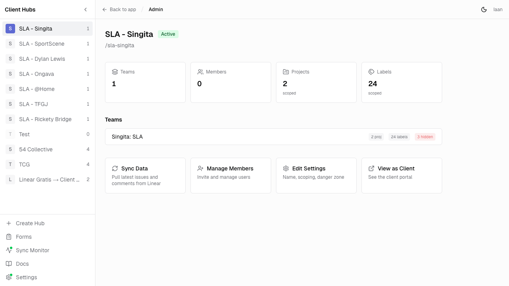
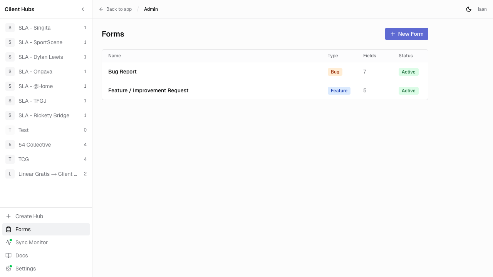
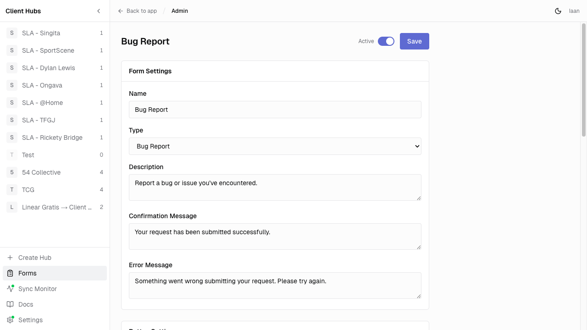
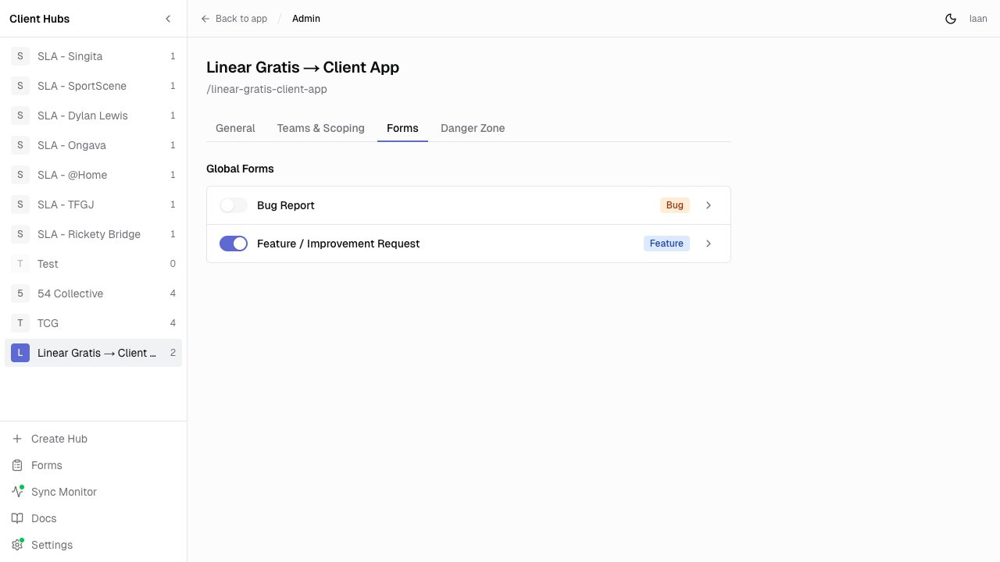
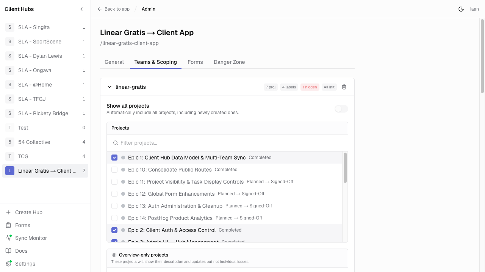
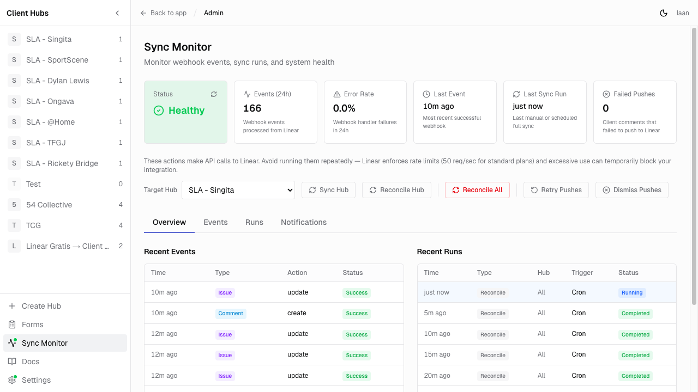
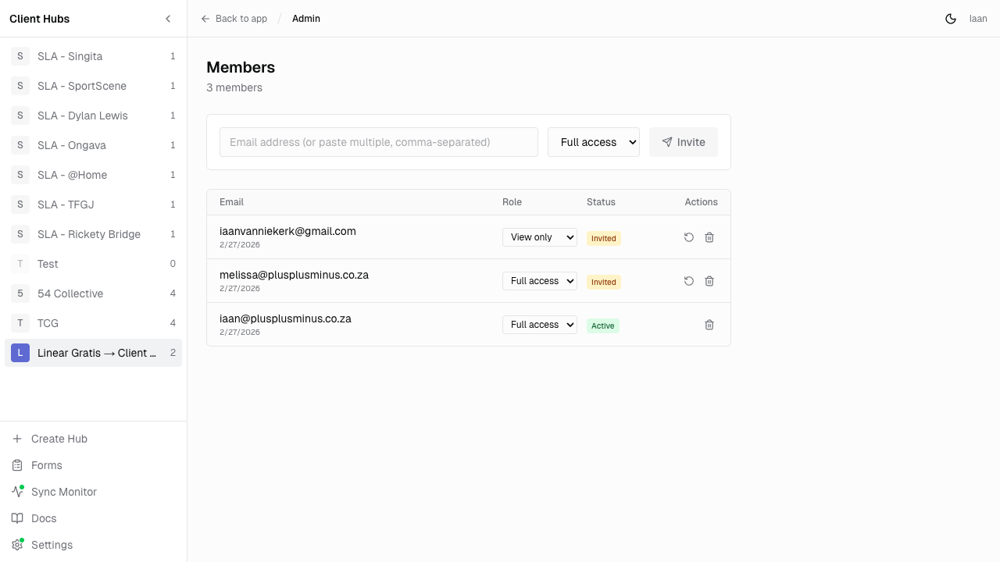
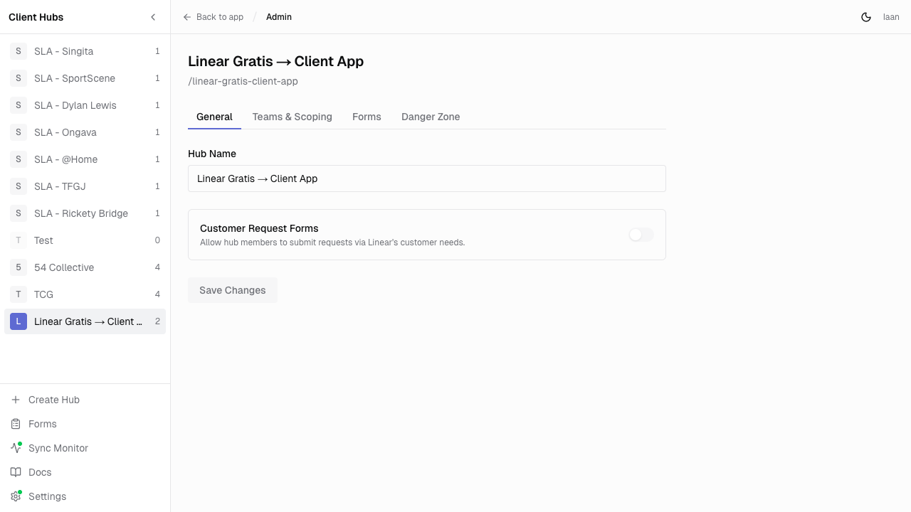
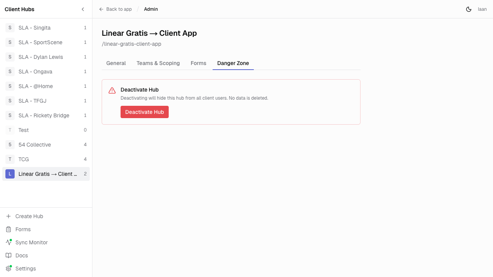
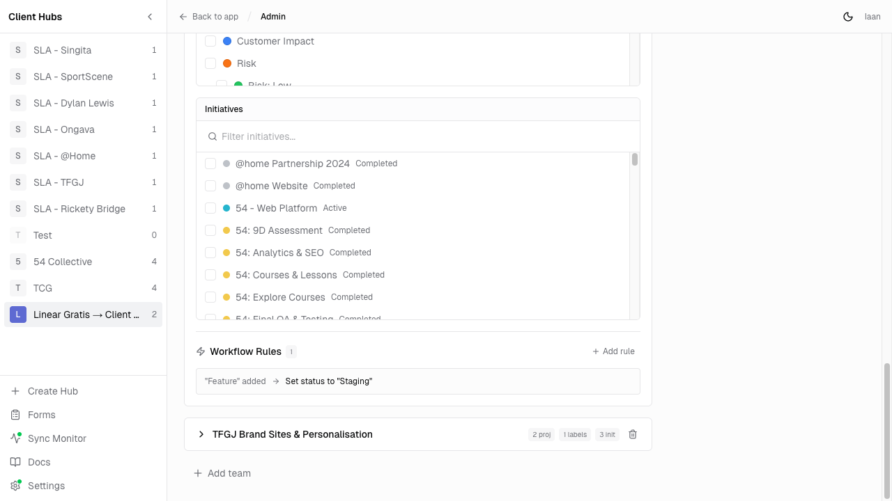

# Hub Administration Guide

How to set up and manage client hubs in Linear Gratis.

## Creating a Hub

1. Go to **Admin > Create Hub** (sidebar)
2. Enter a hub name and connect it to your Linear workspace
3. Map one or more Linear teams to the hub
4. Configure scoping (projects, labels) per team
5. Invite members

*The admin dashboard — sidebar lists all hubs, main area shows hub stats and quick actions.*

## Forms

Forms let clients submit requests (bugs, features, custom) that create Linear issues automatically.

### Global vs Hub-Scoped

- **Global forms** are created at `/admin/forms` and are available to all hubs
- **Per-hub overrides** are configured in each hub's **Settings > Forms** tab:
  - Enable/disable individual forms per hub
  - Override the confirmation message
  - Auto-apply specific Linear labels to submissions from that hub

*Global forms page — manage forms available to all hubs.*

### Form Types

| Type | Purpose |
|------|---------|
| Bug | Bug reports |
| Feature | Feature requests |
| Custom | Freeform — define your own fields |

### Fields & Linear Mapping

Each form has configurable fields (text, textarea, select, radio, checkbox, file, url). Fields can be mapped to Linear issue properties:

- `title` — Issue title
- `description` — Issue description
- `priority` — Issue priority
- `label_ids` — Labels to apply
- `project_id` — Target project
- `cycle_id` — Target cycle

Fields can be marked required, hidden from clients, or given default values.

*Form builder — configure form settings, fields, and Linear field mapping.*

### Button Customisation

Each form has a customisable sidebar button with configurable label and icon (bug, lightbulb, flag, star, zap, etc.).

### Hub-Specific Form Overrides

In each hub's **Settings > Forms** tab, you can enable/disable forms per hub and set hub-specific labels that auto-apply to submissions.

*Per-hub form overrides — enable/disable forms and set auto-apply labels.*

## Project Visibility

Controlled per team mapping in **Settings > Teams & Scoping**.

*Teams & Scoping — select visible projects, overview-only projects, and configure labels.*

### Auto-Include Projects

- **On**: All current and future projects are visible to clients
- **Off**: Only explicitly selected projects appear

### Overview-Only Projects

Projects added to the "overview only" list show their name, status, lead, and description — but **hide all individual issues**. Useful for sharing high-level progress without exposing task-level detail.

## Task Display in Projects

Tasks (issues) within visible projects are shown by default. To hide tasks while still showing the project:

- Add the project to **Overview-only projects** in the scoping editor
- Clients see project metadata and updates but not the issue list

There is no per-issue visibility toggle — visibility is controlled at the project and label level.

## Label Visibility

Two controls per team mapping, configured in the scoping editor:

### Visible Labels

- Empty = all labels shown (no filter)
- Selected labels = only these appear on issue cards
- Acts as an allowlist

### Hidden Labels

- Issues with **any** hidden label are completely excluded from the hub
- Acts as a blocklist — takes precedence over visible labels
- Use for sensitive labels like "Internal", "Security", "Revenue"

Labels support Linear's parent-child hierarchy (label groups). Workflow rules only operate on visible labels.

## Syncing Data

### How Sync Works

Hub data is pulled from Linear and stored locally. Two mechanisms keep it current:

1. **Webhooks** (real-time) — Linear sends events on issue/comment changes, processed at `/api/webhooks/linear`
2. **Manual sync** — Admin clicks the sync button on a hub page to do a full re-sync

### What Gets Synced

Issues, comments, projects, initiatives, cycles, states, and teams — filtered by the hub's scoping rules (visible projects, visible/hidden labels).

### Manual Sync

Click the **Sync** button on any hub's admin page. This triggers a full fetch from Linear for all mapped teams, respecting project and label scoping. Sync progress and results are logged.

### Sync Health Monitor

Available at **Admin > Sync Monitor** (sidebar). Shows:

- **Status**: healthy / degraded / unhealthy
  - Healthy: <5% error rate, events within the last hour
  - Degraded: 5-20% error rate or 1-6h since last event
  - Unhealthy: >20% error rate or >6h since last event
- **Event log**: Individual webhook events with success/failure status
- **Run history**: Manual sync runs with duration and entity counts
- **Email delivery**: Notification queue stats

*Sync Monitor — real-time health status with event log, run history, and email delivery tabs.*

## Adding Members

### Inviting

1. Go to a hub's admin page and open the members panel
2. Enter one or more email addresses (comma, semicolon, or newline separated)
3. Select a role
4. Click invite — WorkOS sends a branded invitation email

*Members panel — invite users by email and manage existing members.*

### Roles

| Role | Access |
|------|--------|
| Default | Full access — view issues, comment, submit forms, vote |
| View Only | Read-only — can browse but not interact |

PPM admins have full access to all hubs automatically and are managed separately (not stored as hub members).

### Member Lifecycle

- **Invited**: Email sent, waiting for first login
- **Active**: User has signed in and claimed their membership
- Admins can resend invites, change roles, or remove members at any time

## Hub Settings

Available tabs on each hub's settings page:

| Tab | Controls |
|-----|----------|
| General | Hub name, deactivate/reactivate |
| Teams & Scoping | Project visibility, label visibility, workflow rules per team |
| Forms | Enable/disable global forms, label overrides, confirmation messages |

*General settings — hub name.*

### Deactivating a Hub

In the **Danger Zone** tab. Deactivated hubs are hidden from clients but no data is deleted. Can be reactivated at any time.

*Danger Zone — deactivate or reactivate a hub.*

## Workflow Rules

Automate Linear issue status changes based on label activity. Configured per team mapping in **Settings > Teams & Scoping**.

*Workflow rules — automate status changes based on label triggers.*

### Trigger Types

| Trigger | Fires when... |
|---------|--------------|
| Label Added | A specific label is added to an issue |
| Label Removed | A specific label is removed |
| Label Changed | A label changes from one value to another |

### Actions

Currently supports **Set Status** — automatically moves the issue to a target Linear state when the trigger fires.

### Example

> When label "Approved" is added → Set status to "In Progress"

Rules only operate on labels in the team's visible labels list. All rule executions are logged for auditability.
